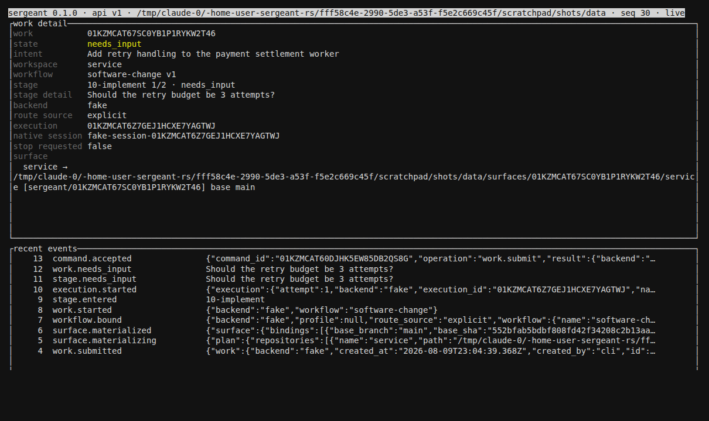
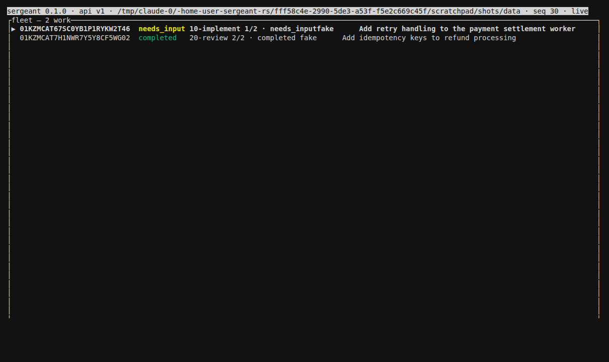

# sergeant-rs


**Sergeant is an AgentOS distro: instructions, skills, and conventions that turn a general-purpose coding harness into an operator of your estate, carried by `sgt` — a durable intent-execution engine that runs to completion whether or not anyone is watching.**

[](https://github.com/miztertea/sergeant-rs/actions/workflows/ci.yml)
[](LICENSE)

Clone it, put `sgt` on `PATH`, point it at your repos, and open your coding
harness there. `AGENTS.md` teaches the harness how to talk to Sergeant —
what to route where, and the loop it drives. When you say *"add retry
handling to the settlement worker,"* the harness shapes that into an
intent and hands it to the engine: `sgt` cuts a git worktree, drives a
staged agent workflow on Claude (or a deterministic fake backend for
testing), and records every state change in an append-only journal. Close
the terminal — the daemon keeps running the work. Come back later and `sgt
work show <id>` or `sgt tui` show exactly where it got to; if it stopped to
ask you something, `sgt respond` answers it.

## Get it

Requires Rust (edition 2024) and `git`. For real agent execution you also
need an installed [`claude` CLI](https://claude.com/claude-code) —
everything else here works without it, via the deterministic fake backend.

```sh
gh repo clone miztertea/sergeant-rs
cd sergeant-rs
cargo install --path . --bin sgt   # first build compiles bundled DuckDB from scratch — that ~10 min figure was measured on an ephemeral cloud container (2026-08-09); on a persistent dev host it's markedly faster
```

That puts `sgt` on `$CARGO_HOME/bin` (usually `~/.cargo/bin`, already on
`PATH` for most Rust installs). Sergeant is clone-is-distro: this checkout
*is* the estate — the exact directory `sergeant.toml` lives in once you
`sgt init` it below. `AGENTS.md`, `skills/`, and `.sergeant/workflows/`
only exist here — stay in it. Sergeant does not search parent directories
for an estate and does not fall back to a plain Git checkout, so every
estate-scoped command run from a bare directory elsewhere refuses outright
rather than quietly finding nothing to read:

```sh
sgt init                              # scaffold the estate: sergeant.toml [estate], repos/, .gitignore
sgt repo add settlement-service --origin git@github.com:you/settlement-service.git
```

(`sgt init` never touches sergeant-rs's own source — it only adds
`sergeant.toml`, `repos/`, and a couple of `.gitignore` entries alongside
it. Your added repos live under `repos/`, gitignored, separate from this
checkout's own tracked files.)

Then open your harness (Claude Code or another agent CLI) in this same
directory and just say what you want. It reads `AGENTS.md`, shapes an
intent, and drives `sgt run` on your behalf — see [`AGENTS.md`](AGENTS.md)
for exactly how it routes and the loop it follows, and the [workflow
catalog](#workflows) below for what a workflow actually is.

### Installing a released binary instead of building from source

`dist` (cargo-dist) publishes a prebuilt `sgt` for each [release](https://github.com/miztertea/sergeant-rs/releases), plus a `curl | sh` convenience installer:

```sh
curl -fsSL https://github.com/miztertea/sergeant-rs/releases/download/v0.1.0/sergeant-rs-installer.sh | sh
```

**This one-liner does not verify anything.** It downloads the archive for
your platform and installs it — it does not check a checksum, a signature,
or an attestation. If you watch its output you'll see it say so plainly:
`no checksums to verify`. That line isn't a warning about a missing file;
`dist`'s generated installer declares the local variables it would use to
verify a checksum but nothing in the script ever assigns them, so the
verification branch is structurally unreachable — the installer always
takes the "nothing to verify" path, for every release. Convenient, but it
gives you no evidence the artifact you're running is the one this project
published.

If you want that evidence, verify by hand — it's a few extra commands, run
once per release:

```sh
# 1. Download the archive for your platform, its checksum file, and the installer.
mkdir -p /tmp/sgt-install && cd /tmp/sgt-install
gh release download v0.1.0 --repo miztertea/sergeant-rs \
  -p 'sergeant-rs-x86_64-unknown-linux-gnu.tar.xz' \
  -p 'sergeant-rs-x86_64-unknown-linux-gnu.tar.xz.sha256'

# 2. Check the archive's contents match what was published.
sha256sum -c sergeant-rs-x86_64-unknown-linux-gnu.tar.xz.sha256

# 3. Check the archive was actually built by this repo's release workflow,
#    not just that some file with a matching hash was uploaded somewhere.
gh attestation verify sergeant-rs-x86_64-unknown-linux-gnu.tar.xz --owner miztertea

# 4. Only after both checks pass, extract and install by hand.
tar xf sergeant-rs-x86_64-unknown-linux-gnu.tar.xz
install -m 755 sergeant-rs-x86_64-unknown-linux-gnu/sgt ~/.local/bin/sgt
sgt --version
```

Step 2 confirms the bytes weren't corrupted or swapped in transit; step 3
confirms they came from a GitHub Actions run of *this* repository's
`release.yml`, via Sigstore/GitHub's build-provenance attestation — the
thing the convenience one-liner skips entirely. Swap the target triple
(`aarch64-apple-darwin`) and `~/.local/bin` for your platform and preferred
install location as needed.

Want to see the whole loop first, with no tokens spent and no estate to
set up? `scripts/demo.sh` builds the debug binary itself and drives it end
to end in a throwaway repo — submit → worktree → stage runs and *stops to
ask a question* → you answer → independent review stage → completed →
retired — deterministically, on the fake backend, printing where the
evidence lives at every step. It exits 0 or the walkthrough is broken:

```sh
scripts/demo.sh
```

Already built a release binary above with `cargo install`? Point the
script at it instead of paying for a second (debug) DuckDB build:
`SGT_BIN=$(command -v sgt) scripts/demo.sh`.

With no `claude` CLI installed, add `--backend fake` to any `sgt run` to
try the loop without spending tokens.

## See it

The images below are from the M6-era minimal Fleet/Detail TUI, superseded
by the T-series `Home / Fleet / Workflows / Estate` cockpit
(`sergeant-rs-workspace/knowledge/evidence/reference/proposal-tui-t-series.md`) — real terminal PNG captures of the
current TUI are a pending follow-up (no real-terminal session was
available to capture them from). `docs/tui-screenshots/*.txt` has honest,
current renders in the meantime — actual `ratatui::TestBackend` output
flattened to plain text, not mockups; regenerate with `cargo test --lib --
--ignored generate_t4_wide_screenshots`.

| TUI — work detail with live journal tail (M6, superseded) | TUI — fleet (M6, superseded) |
|---|---|
|  |  |

## Using sgt day-to-day

Every command below is copy-pasteable, run from the estate root; every command takes `--json` for scripting, `--data-dir <dir>` to point at a non-default data directory, and `-C <estate-root>` to name the estate explicitly instead of `cd`-ing there first. Default precedence: `--data-dir` → `$SGT_DATA_DIR` → this estate's own `.sergeant/data` (only when the current directory — or `-C`'s target — *is* the estate root exactly; sergeant never searches parent directories for one, this is the path `sgt init`'s `.gitignore` entry covers, and what keeps sergeant's state out of `~`) → `$XDG_DATA_HOME/sergeant` → `~/.local/share/sergeant`. One wrinkle: the very first `sgt init` in a fresh directory reports its health check against the pre-estate fallback (`$XDG_DATA_HOME`/`~/.local/share/sergeant`), since the estate doesn't exist yet at the instant that check runs — every command after that first one resolves to `<estate>/.sergeant/data` as expected.

**Submit work**, from the exact estate root — a multi-repository estate must name a scope explicitly (`--repo`/`--group`/`--all`); a one-repository estate infers its only repository:

```sh
sgt run "add retry handling to the settlement worker"
sgt run "add retry handling" --backend claude --workflow software-change --repo billing-service
```

`run` takes an intent plus optional `--workflow <name>`, `--backend <claude|fake>`, `--profile <name>` (a launch profile), `--repo <name>` (repeatable, for multi-repo work), `--group <name>` (a declared estate group, expanded into the same repo selection), `--all` (every declared repository, explicit and journaled), `--turns <n>`/`--ceiling-secs <n>` (override this one work item's turn envelope instead of the daemon-wide default), and `--override-git-preflight` (waives a dirty-or-detached mount for this one submission, never anything else — `sgt run --help` is the authority on the full current list).

**Watch it** — CLI or TUI, same daemon state through the same API, pick whichever fits:

```sh
sgt status              # daemon health + work counts, by state
sgt work list            # the fleet: id, state, intent
sgt work show <id>       # one item: stage, execution, surface, output pointer, recent events
sgt work show <id> --graph   # the work's provenance graph instead of its record
sgt work transcript <id> # decode the work's conversation from the journal, in causal order
sgt tui                   # Home/Fleet/Workflows/Estate cockpit, live over SSE
sgt                       # no subcommand: a homepage — logo, quickstart, no daemon contact
```

**Wait for it, instead of polling** (`sergeant-rs-workspace/knowledge/evidence/gauntlet/contracts/WATCH.md`):

```sh
sgt watch <id>                # block until this Work needs attention or ends, then print it
sgt --json watch <id>         # same, one sergeant.watch/v1 JSON object
sgt --json watch <id> --follow  # stay attached across every nonterminal match too
sgt --json watch --follow     # future attention/result transitions across the whole estate
```

`sgt watch` replaces a `sgt work show <id>` polling loop with one blocking
call: it is silent while nothing has changed, and default mode emits
exactly one notice and exits — `--json` makes that notice one compact
JSON object per line (JSONL; no wrapping array, ever). No output means no
matching transition has happened yet. Watched states are `needs_input`,
`blocked`, `waiting`, `failed`, `completed`, `canceled`; `pending` and
`active` never produce a notice. A scoped `--follow` watcher exits once
the Work reaches `completed`/`canceled`, but stays attached through
`needs_input`/`blocked`/`waiting`/`failed` — including `failed`: a Work
that fails and is never retried or canceled leaves a `--follow` watcher
attached indefinitely after it has already reported the failure, since
nothing auto-resumes it. `sgt watch` does not wake or launch a harness —
it is a quiet process contract a harness's own tool-call or
background-command facility drives — and, unlike every other client verb
here, it never auto-spawns a daemon: point it at a data dir with nothing
running and it refuses with the remedy rather than starting one, because
observing must not materialize the thing being observed.

For an estate-wide watch (no Work id), attach the watcher *before* running
`sgt status`/`sgt work list`, not after: an estate-wide watch is
edge-triggered from the moment it attaches, so anything that lands after
reconciliation but before an after-the-fact watch would otherwise fall in
an unwatched gap. Stated honestly: a bare one-shot estate watch invoked
*after* reconciliation still carries that gap — there is no `--from <seq>`
replay in this version to close it after the fact.

**Respond when a stage is waiting on you** (state `needs_input`):

```sh
sgt respond <id> "yes, 3 attempts with exponential backoff"
```

**Retry, extend, or cancel:**

```sh
sgt retry <id>                  # retry the current stage of a failed, blocked, or waiting work item
sgt extend <id> <extra-turns>   # work blocked on an exhausted turn envelope: grant more turns, then `sgt retry`
sgt cancel <id>
```

**Ask questions of your own history:**

```sh
sgt analytics                        # list the canned questions, and how populated the projection is
sgt analytics blocked_time_per_work  # answer one of them
```

**Diagnose a broken install:**

```sh
sgt doctor
```

Checks git, the `claude` CLI (presence and version gate), whether the toolchain directories `sgt claude` (and its siblings) would add to `PATH` are already on it, the data directory, Docker (capability probe), the journal (full validating replay), the analytics projection, the daemon, whether the current directory is an exact estate root, the effective permission mode each declared profile launches with, (inside an estate) the estate manifest's own health, the declared workflow catalog, a cheap Git-surface summary (active/retained worktrees and patches, retained bytes, journaled Work branches, terminal-dirty Works — from the journal and retained-artifact filesystem metadata only, never a per-branch `git` walk), and disk pressure inside the data directory — in that order, so a fault is reported under the right name; an unwritable data directory makes Docker and disk pressure decline with a pointer back to the `data_dir` row instead of re-diagnosing the same fault under their own name. Every failing check names its remedy; `sgt doctor` does **not** auto-spawn a daemon, because it's diagnosing the installation, not priming it — it joins `status`, `work`, `analytics`, `watch`, `tui`, and `daemon stop` in never materializing a daemon just to observe it (only `run`/`respond`/`retry`/`extend`/`cancel` do that).

**Launch a harness bound to this estate:**

```sh
sgt claude                     # or codex / opencode / goose
sgt claude -- --model opus     # everything after `--` passes through verbatim
```

Composes an environment (enriches `PATH` with `~/.cargo/bin` and `~/.local/bin` when they exist, binds `SGT_DATA_DIR` to this invocation's resolved data dir) and **exec**s into the harness — replacing the `sgt` process, never forking and supervising it (`docs/adr/0006-harness-passthrough.md`).

**Manage the estate** — the directory declaring the repositories and groups a work item can target with `--repo`/`--group`:

```sh
sgt init                              # scaffold [estate] in sergeant.toml, repos/, .gitignore entries
sgt repo add <name> --origin <url>    # clone repos/<name> and declare it (origin optional if it's already there)
sgt repo add <name> --upstream <url>  # also declare an upstream and set it as the mount's `upstream` remote (forge-neutral)
sgt repo remove <name>                # undeclare it (refuses while a group still lists it; never deletes repos/<name>)
sgt repo list                         # declared repositories
sgt group add <name> <repo>...        # declare or extend a group (mkdir-p semantics)
sgt group remove <name> [<repo>...]   # drop members, or the whole group with none given
sgt group list                        # declared groups and their members
```

**Stop the daemon cleanly** — pauses admission, waits for in-flight work to drain, then shuts down (idempotent):

```sh
sgt daemon stop
```

## Workflows

A workflow is a directory, not code: a `workflow.toml` naming ordered stages, and one `CONTEXT.md` per stage directory. Drop one in your own repository and `sgt run` picks it up automatically:

```text
.sergeant/workflows/<name>/
├── workflow.toml            # [workflow] name, version, stages = ["00-...", "10-...", ...]
├── CONTEXT.md                # workflow orientation (optional)
├── 00-<stage>/
│   └── CONTEXT.md            # the stage's contract — the only thing the engine reads per stage
├── 10-<stage>/
│   └── CONTEXT.md
└── ...
```

Route to it explicitly (`sgt run "..." --workflow <name>`), or leave `--workflow` off and `sgt` uses the estate's own `software-change` workflow if it has declared one under `.sergeant/workflows/`, falling back to the built-in default otherwise. Backends are selected per work item (`--backend claude|fake`) or by named routing profiles in `sergeant.toml`. A profile can also pin the permission mode Claude turns launch with (`permission_mode = "acceptEdits"` in the profile's `options` table, using the CLI's own `--permission-mode` vocabulary); with no mode set, `sgt` passes no permission flag at all — never a silent bypass — and `sgt doctor` reports each profile's effective mode.

This repository dogfoods its own convention under `.sergeant/`: `.sergeant/index.md` catalogs every published workflow (23 at last count — code review, TDD, diagnosing a bug, resolving a merge conflict, breaking a plan into tickets, and more), and [`repo-to-icm`](.sergeant/workflows/repo-to-icm/) — a ten-stage workflow that converts a repository's scattered procedural knowledge (skills, agent instructions, scripts, docs) into reviewable draft workflow packages — is the worked example. Read its [`index.md`](.sergeant/workflows/repo-to-icm/index.md) and [`CONTEXT.md`](.sergeant/workflows/repo-to-icm/CONTEXT.md) for how a real multi-stage workflow is laid out, and see [`AGENTS.md`](AGENTS.md) for how an agent operating in this repo is expected to discover and route to one. Alongside it, `skills/<name>/SKILL.md` is the operator-skills layer — instructions the harness loads directly for judgment/dialogue work that never needs a dispatched Work item (`sergeant-help`, `grilling`, `grill-with-docs`, `estate-navigation`).

Full authoring rules — the four-layer context model (workflow orientation, stage contract, stable references, per-run artifacts), directory shapes, and what's a convention violation — are in [`docs/icm/convention.md`](docs/icm/convention.md).

## How it works

```
   sgt CLI ──┐            ┌────────────────────────── daemon (one per user) ──┐
   sgt TUI ──┴─ HTTP/SSE ─┤  engine → workflows → routing → Backend trait     │
                          │      │                    ├── claude (headless    │
                          │  append-only journal      │     print-mode turns) │
                          │  + blob store             └── fake (deterministic)│
                          │      │                                            │
                          │  projections: in-memory · DuckDB · graph          │
                          └──── work surfaces: git worktrees, one per work ───┘
```

Every state change — submit, worktree binding, stage entry, each model turn's raw output, the question the agent asked, your answer — is an event in a crash-tolerant journal (large payloads in a BLAKE3 content-addressed blob store). Everything else — the in-memory work state, the DuckDB analytics tables, the graph projection, every client screen — is a disposable projection rebuilt from it; there is no snapshot loading. The daemon exclusively owns the data directory and every process handle; clients (CLI, TUI) hold no state of their own and reach it only through the same loopback HTTP/SSE API — a structural test fails if one gets a private shortcut. A Claude "session" is a durable conversation identity, not a process: the OS process exists per turn, so killing the daemon mid-execution and restarting it resumes on unambiguous evidence, or fails closed into `blocked` with a stated reason — never a guess. Each work item gets its own git worktree on its own branch (`sergeant/<work-id>`), outside your checkout, so agents never fight over a working tree. A third `Backend` — `docker` — runs `kind = "execute"` workflow stages (pinned, offline containers) rather than agent turns; it isn't user-selectable via `--backend`, since a workflow's own stages declare their kind.

This — the engine described above — is the core `sgt` carries; everything under `.sergeant/`, `AGENTS.md`, and this repo's own skills is the OS layered on top of it. The full destination for both halves, and the rulings that shape them, is [`NORTH-STAR.md`](NORTH-STAR.md).

This is a clean-room Rust successor to [callmeradical/sergeant](https://github.com/callmeradical/sergeant) — the Bash/tmux original whose failure modes became this project's regression-test catalog. The architecture is specified in [a full proposal](sergeant-rs-workspace/knowledge/evidence/reference/proposal-depot-rust-execution-surface.md) committed to this repo; the ICM workflow model layered on top of it is specified in [its successor](sergeant-rs-workspace/knowledge/evidence/reference/proposal-next-iteration-icm-workflows.md); every deviation from either is registered with rationale in [GAUNTLET.md](GAUNTLET.md).

## Status

The core engine and CLI (journal, projections, the Backend boundary — Claude, fake, and Docker execute stages — the estate manifest, and every verb in "Using sgt day-to-day" above) are built and gated on `cargo test`; the workflow catalog and this file are the OS layer built on top of it, both converging toward the ship gate in [`NORTH-STAR.md`](NORTH-STAR.md)'s MVP plan. The complete development record — every milestone, every wrong turn — is in [GAUNTLET.md](GAUNTLET.md) and [LESSONS.md](LESSONS.md); the method that produced it is in [sergeant-rs-workspace/knowledge/evidence/reference/notes/gauntlet-pattern.md](sergeant-rs-workspace/knowledge/evidence/reference/notes/gauntlet-pattern.md).

## Contributors

Working on sergeant-rs itself (not just using `sgt` against your own repos)? The dev rulebook — build commands, architecture invariants, testing rules, the shipping gate, per-host environment facts — is [`docs/DEVELOPMENT.md`](docs/DEVELOPMENT.md); `AGENTS.md` points there too under "Working on sergeant-rs itself."

```sh
cargo fmt --check && cargo clippy --all-targets -- -D warnings && cargo test   # the gates
cargo test --test m4_backends              # one suite
SERGEANT_CLAUDE_TESTS=1 cargo test --test m4_backends -- --ignored   # opt-in: real claude CLI, bills tokens
```

The record that governs how this project decides things: [`NORTH-STAR.md`](NORTH-STAR.md) (the destination and the rulings), [`GAUNTLET.md`](GAUNTLET.md) (the append-only ledger — deviation register, backlog, per-milestone scorecards), [`LESSONS.md`](LESSONS.md) (binding lessons from what went wrong), `sergeant-rs-workspace/knowledge/evidence/gauntlet/contracts/` (what each milestone actually promised), and [`docs/adr/`](docs/adr/README.md) (architecture decisions that fix a shape once, with [`docs/glossary.md`](docs/glossary.md) for the vocabulary they fix).

## Lineage & License

This is a clean-room Rust successor to [callmeradical/sergeant](https://github.com/callmeradical/sergeant), which was itself inspired by [kunchenguid/firstmate](https://github.com/kunchenguid/firstmate).

[MIT](LICENSE).
