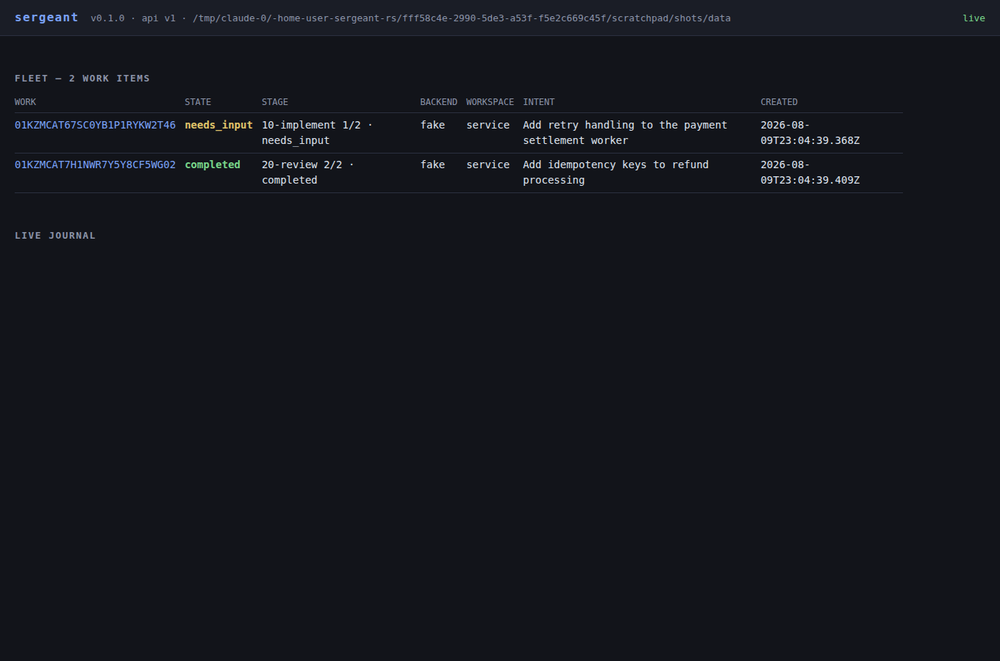
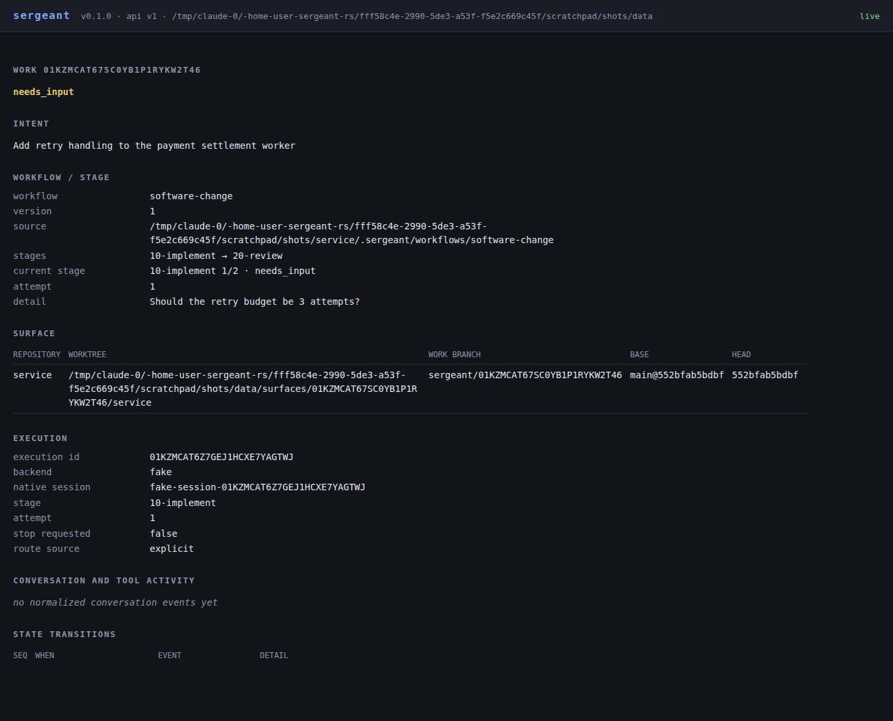

# sergeant-rs

**`sgt`: submit an intent, get a durable agent run in an isolated git worktree, watch it or walk away.**

[](https://github.com/miztertea/sergeant-rs/actions/workflows/ci.yml)
[](LICENSE)

`sgt run "<intent>"` submits work to a local daemon, which cuts a git worktree, drives a staged agent workflow on Claude (or a deterministic fake backend for testing), and records every state change in an append-only journal. Close the terminal — the daemon keeps running the work. Come back later and `sgt work show <id>`, the TUI, or the dashboard show exactly where it got to; if it stopped to ask you something, `sgt respond` answers it.

## See it

| TUI — work detail with live journal tail | Dashboard — fleet |
|---|---|
|  |  |

| TUI — fleet | Dashboard — work detail |
|---|---|
|  |  |

## Quickstart

Requires Rust (edition 2024) and `git`. For real agent execution you also need an installed [`claude` CLI](https://claude.com/claude-code) — everything else here works without it, via the deterministic fake backend.

```sh
git clone https://github.com/miztertea/sergeant-rs
cd sergeant-rs
cargo build --release        # first build compiles bundled DuckDB (~10 min); after that it's fast

scripts/demo.sh              # the full walkthrough, deterministic, no tokens spent
```

The demo drives the entire loop in a throwaway repo — submit → worktree → stage runs and *stops to ask a question* → you answer → independent review stage → completed → retired — and prints where the evidence lives at every step (journal path, blob refs, analytics query, graph endpoint, dashboard URL). It exits 0 or the walkthrough is broken.

Once that's worked, try it against a real repository:

```sh
cd /path/to/any/git/repo
sgt run "add retry handling to the settlement worker"   # daemon auto-spawns if needed
sgt                                                       # no subcommand: the TUI, live
```

With no `claude` CLI installed, add `--backend fake` to `sgt run` to try the loop without spending tokens.

## Using sgt day-to-day

Every command below is copy-pasteable; every command takes `--json` for scripting and `--data-dir <dir>` to point at a non-default data directory (default: `$SGT_DATA_DIR`, else `~/.local/share/sergeant`).

**Submit work**, from inside any git repository:

```sh
sgt run "add retry handling to the settlement worker"
sgt run "add retry handling" --backend claude --workflow software-change --repo billing-service
```

`run` takes an intent plus optional `--workflow <name>`, `--backend <claude|fake>`, `--profile <name>` (a launch profile), `--repo <name>` (repeatable, for multi-repo work), and `--workspace <name>`.

**Watch it** — three equal clients, same daemon state, pick whichever fits:

```sh
sgt status              # daemon health + work counts, by state
sgt work list            # the fleet: id, state, intent
sgt work show <id>       # one item: stage, execution, surface, recent events
sgt work show <id> --graph   # the work's provenance graph instead of its record
sgt                       # no subcommand: the TUI — fleet + detail, live over SSE
sgt web                  # print the dashboard URL (tokenized, loopback-only)
sgt web --open            # ...and open it in a browser
```

**Respond when a stage is waiting on you** (state `needs_input`):

```sh
sgt respond <id> "yes, 3 attempts with exponential backoff"
```

**Retry or cancel:**

```sh
sgt retry <id>     # retry the current stage of a failed, blocked, or waiting work item
sgt cancel <id>
```

**Ask questions of your own history:**

```sh
sgt analytics                        # list the canned questions, and how populated the projection is
sgt analytics blocked_time_per_work  # answer one of them
```

**Diagnose a broken install:**

```sh
sgt doctor
```

Checks git, the `claude` CLI (presence and version gate), the data directory, the journal (full validating replay), the analytics projection, and the daemon — in that order, so a fault is reported under the right name. Every failing check names its remedy; `sgt doctor` does **not** auto-spawn a daemon (every other command does), because it's diagnosing the installation, not priming it.

## Workflows

A workflow is a directory, not code: a `workflow.toml` naming ordered stages, and one `CONTEXT.md` per stage directory. Drop one in your own repository and `sgt run` picks it up automatically:

```text
.sergeant/workflows/<name>/
├── workflow.toml            # [workflow] name, version, stages = ["00-...", "10-...", ...]
├── CONTEXT.md                # workflow orientation (optional)
├── 00-<stage>/
│   └── CONTEXT.md            # the stage's contract — the only thing the engine reads per stage
├── 10-<stage>/
│   └── CONTEXT.md
└── ...
```

Route to it explicitly (`sgt run "..." --workflow <name>`), or leave `--workflow` off and `sgt` uses the workspace's own `software-change` workflow if the repo has one, falling back to the built-in default otherwise. Backends are selected per work item (`--backend claude|fake`) or by named routing profiles in `sergeant.toml`.

This repository dogfoods its own convention under `.sergeant/`: `.sergeant/index.md` catalogs every published workflow, and [`repo-to-icm`](.sergeant/workflows/repo-to-icm/) — a ten-stage workflow that converts a repository's scattered procedural knowledge (skills, agent instructions, scripts, docs) into reviewable draft workflow packages — is the worked example. Read its [`index.md`](.sergeant/workflows/repo-to-icm/index.md) and [`CONTEXT.md`](.sergeant/workflows/repo-to-icm/CONTEXT.md) for how a real multi-stage workflow is laid out, and see `AGENTS.md` for how an agent operating in this repo is expected to discover and follow one.

Full authoring rules — the four-layer context model (workflow orientation, stage contract, stable references, per-run artifacts), directory shapes, and what's a convention violation — are in [`docs/icm/convention.md`](docs/icm/convention.md).

## How it works

```
   sgt CLI ──┐
   sgt TUI ──┤            ┌────────────────────────── daemon (one per user) ──┐
   dashboard ┴─ HTTP/SSE ─┤  engine → workflows → routing → Backend trait     │
                          │      │                    ├── claude (headless    │
                          │  append-only journal      │     print-mode turns) │
                          │  + blob store             └── fake (deterministic)│
                          │      │                                            │
                          │  projections: in-memory · DuckDB · graph          │
                          └──── work surfaces: git worktrees, one per work ───┘
```

Every state change — submit, worktree binding, stage entry, each model turn's raw output, the question the agent asked, your answer — is an event in a crash-tolerant journal (large payloads in a BLAKE3 content-addressed blob store). Everything else — the in-memory work state, the DuckDB analytics tables, the graph projection, every client screen — is a disposable projection rebuilt from it; there is no snapshot loading. The daemon exclusively owns the data directory and every process handle; clients (CLI, TUI, dashboard) hold no state of their own and reach it only through the same loopback HTTP/SSE API — a structural test fails if one gets a private shortcut. A Claude "session" is a durable conversation identity, not a process: the OS process exists per turn, so killing the daemon mid-execution and restarting it resumes on unambiguous evidence, or fails closed into `blocked` with a stated reason — never a guess. Each work item gets its own git worktree on its own branch (`sergeant/<work-id>`), outside your checkout, so agents never fight over a working tree.

This is a clean-room Rust successor to [callmeradical/sergeant](https://github.com/callmeradical/sergeant) — the Bash/tmux original whose failure modes became this project's regression-test catalog. The architecture is specified in [a full proposal](reference/proposal-depot-rust-execution-surface.md) committed to this repo; the ICM workflow model layered on top of it is specified in [its successor](reference/proposal-next-iteration-icm-workflows.md); every deviation from either is registered with rationale in [GAUNTLET.md](GAUNTLET.md).

## Status

**P0 (the full vertical slice above) is complete** — 218 tests + 2 opt-in live-Claude, zero leaked daemons across the suite. **P1 performance baselining is done**: the full load/stress matrix ran against the release binary and is written up in [`docs/perf/baseline-2026-08-10.md`](docs/perf/baseline-2026-08-10.md), with findings tracked as GitHub issues. The **N-series** (ICM workflows, per-stage harnesses, Docker execute stages) is in progress — see [GAUNTLET.md](GAUNTLET.md)'s N0–N2 entries for what's landed so far, including the `repo-to-icm` workflow linked above. The prototype was built end-to-end by a multi-agent gauntlet loop (bounded contracts, blind critic panels, adversarial verification); the complete development record — including every wrong turn — is in [GAUNTLET.md](GAUNTLET.md) and [LESSONS.md](LESSONS.md), and the method in [reference/notes/gauntlet-pattern.md](reference/notes/gauntlet-pattern.md).

## Developing

```sh
cargo fmt --check && cargo clippy --all-targets -- -D warnings && cargo test   # the gates
cargo test --test m4_backends              # one suite
SERGEANT_CLAUDE_TESTS=1 cargo test --test m4_backends -- --ignored   # opt-in: real claude CLI, bills tokens
```

See [CLAUDE.md](CLAUDE.md) for the repo's working rules (they bind humans too) and `docs/gauntlet/contracts/` for what each milestone promised.

## Lineage & License

This is a clean-room Rust successor to [callmeradical/sergeant](https://github.com/callmeradical/sergeant), which was itself inspired by [kunchenguid/firstmate](https://github.com/kunchenguid/firstmate).

[MIT](LICENSE).
